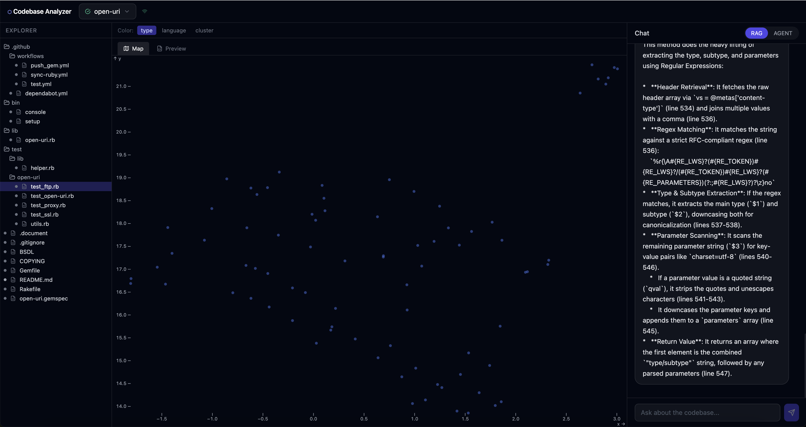
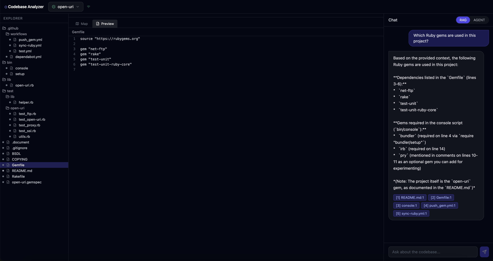
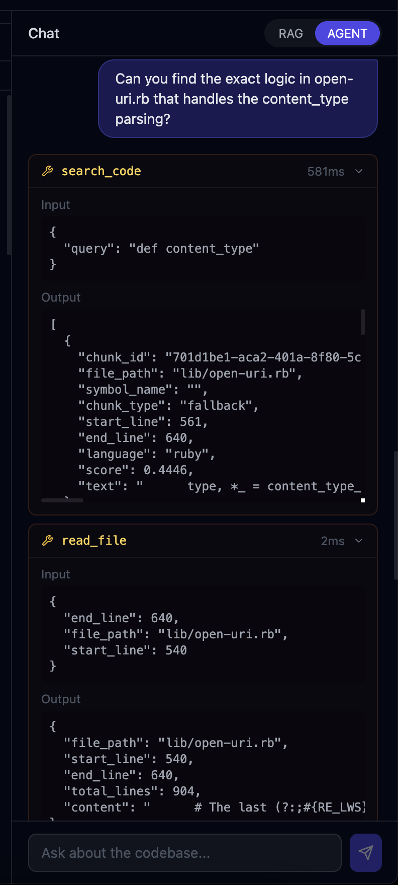
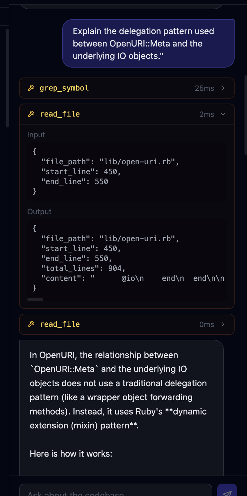

# Codebase Analyzer

**mertrace** 

A full-stack AI engineering project that turns any Git repository into a searchable, conversational knowledge base. Built to demonstrate production-grade RAG architecture, local ML inference, real-time streaming, and agentic tool use — all in a single deployable system.

## What This Project Demonstrates

This is not a wrapper around a hosted AI API. Every technically interesting part runs locally:

| Concern | Approach | Why it matters |
|---|---|---|
| **Code parsing** | tree-sitter AST (not regex, not line splits) | Extracts real symbols — functions, classes, methods — with exact line ranges |
| **Embeddings** | `all-MiniLM-L6-v2` on CPU | Zero API cost, no rate limits, 384-dim vectors in ~5ms per chunk |
| **Retrieval** | Dense (cosine) + BM25 fused via RRF | Hybrid search outperforms either method alone on code |
| **Context assembly** | Token-budget packing with file grouping | Maximises LLM context quality within a hard token cap |
| **Agentic mode** | 3-step linear agent with 4 tools | LLM explores the codebase before answering — no hallucinated paths |
| **Streaming** | WebSocket token streaming + indexing progress | Real-time UX without polling |
| **Visualisation** | UMAP + HDBSCAN → Observable Plot scatter | Entire codebase embedding space in 2D, colored by type/language/cluster |

## ✨ Features

- **Hybrid RAG** — semantic search (sentence-transformers) + BM25 fused via Reciprocal Rank Fusion
- **Agentic mode** — LLM uses tools (`search_code`, `read_file`, `grep_symbol`, `list_files`) to explore before answering
- **AST-aware chunking** — tree-sitter parses Python, TypeScript, JavaScript, Go into function/class/method chunks
- **UMAP scatter plot** — visualize the entire codebase embedding space, colored by type/language/cluster
- **Citation-linked preview** — click any citation in chat to jump to the exact file and line
- **Live indexing progress** — WebSocket streams cloning → chunking → embedding → UMAP stages
- **Custom LLM provider** — works with any OpenAI-compatible API (Together AI, Groq, Ollama, LM Studio)
- **Fully local embeddings** — `all-MiniLM-L6-v2` runs on CPU, zero API cost

---

## 📸 Screenshots

### Main Interface — 3-Pane Layout

*File explorer (left) · UMAP embedding map / file preview (center) · AI chat (right). The scatter plot shows every indexed chunk as a point in 2D embedding space.*

### RAG Mode — Answers with Source Citations

*Every answer links back to the exact file and line range. Click a citation to open the file preview with the relevant lines highlighted.*

### Agent Mode — Live Tool Execution

*In agent mode the LLM decides which tools to call, executes them against the real codebase, then synthesizes a grounded answer. Tool calls stream in real time.*

### Agent Mode — Tool Call Detail

*Each tool call card is expandable — showing the exact input sent to the tool, the output returned, and execution time in milliseconds.*

---

## 🏗 Technical Architecture
**Ingestion pipeline:**
```
Git URL / local path
  → Clone (GitPython, shallow)
  → Walk + .gitignore filter (pathspec)
  → AST parse + chunk (tree-sitter per language)
  → Embed in batches (sentence-transformers, local)
  → Upsert to ChromaDB
  → UMAP (5D → 2D) + HDBSCAN clustering
  → Progress streamed via WebSocket
```

**Query pipeline (RAG mode):**
```
User query
  → Embed query locally (all-MiniLM-L6-v2, ~5ms)
  → Semantic search in ChromaDB (cosine, top-20)
  → BM25 keyword search (rank_bm25, top-10)
  → Reciprocal Rank Fusion → top-30 fused
  → FlashRank cross-encoder rerank → top-5
  → Token-budget context assembly (4000 token cap)
  → Single streaming LLM call
  → Citations streamed back to frontend
```

**Query pipeline (Agent mode):**
```
User query
  → LLM decides tools to call (up to 3 rounds)
  → Tools execute locally: search_code / read_file / grep_symbol / list_files
  → Tool results added to context
  → Single streaming LLM synthesis call
  → Full tool trace streamed to frontend
```

**Stack:**

| Layer | Technology |
|---|---|
| API server | FastAPI + uvicorn (async) |
| WebSocket | FastAPI native WS |
| Database | SQLite via SQLModel + aiosqlite |
| Vector store | ChromaDB (local, persistent) |
| Embeddings | sentence-transformers (local CPU) |
| AST parsing | tree-sitter (Python, TS, JS, Go) |
| Reranking | FlashRank (local cross-encoder) |
| Dimensionality reduction | UMAP + HDBSCAN |
| LLM routing | LiteLLM (any OpenAI-compatible provider) |
| Frontend | React 18 + TypeScript + Vite |
| State management | Zustand |
| Data fetching | TanStack Query |
| Visualisation | Observable Plot |

---

## 🚀 Quick Start


- Python 3.11+
- Node.js 18+
- [uv](https://github.com/astral-sh/uv) — `pip install uv`

### 1. Clone and install

```bash
git clone https://github.com/your-username/codebase-analyzer
cd codebase-analyzer
make install
make init-dirs
```

### 2. Configure environment

```bash
cp env.example .env
```

Edit `.env`:

```env
# LLM — any OpenAI-compatible provider
LITELLM_MODEL=openai/gpt-4o-mini
LLM_API_BASE=https://api.your-provider.com/v1
LLM_API_KEY=sk-your-key-here
```

### 3. Run

```bash
make dev
```

- Frontend: http://localhost:5173
- Backend API: http://localhost:8000
- API docs: http://localhost:8000/api/docs

---
## 📁 Project Structure

```
codebase-analyzer/
├── backend/
│   ├── app/
│   │   ├── agent/          # Agentic workflow (tools, memory, orchestrator)
│   │   ├── api/            # FastAPI routes + WebSocket handler
│   │   ├── core/           # Config, logging
│   │   ├── ingestion/      # Clone, walk, chunk, embed, UMAP
│   │   ├── models/         # SQLModel schemas
│   │   └── rag/            # Retriever, reranker, assembler, synthesizer
│   └── tests/
├── frontend/
│   └── src/
│       ├── api/            # REST client
│       ├── components/     # ChatPanel, FileExplorer, VectorViz
│       ├── hooks/          # useProject, useWebSocket
│       └── store/          # Zustand app state
├── data/                   # Runtime data (gitignored)
│   ├── chroma/             # ChromaDB vector store
│   ├── projects/           # File trees, UMAP data
│   └── source/             # Cloned repositories
├── env.example
├── Makefile
└── README.md
```

---

## 🔧 Development

```bash
make dev-backend    # FastAPI with hot reload
make dev-frontend   # Vite dev server
make lint           # Ruff lint
make format         # Ruff auto-format
make clean          # Remove build artifacts
```

Enable debug mode for pretty-printed LLM call logs:

```env
DEBUG=true
LOG_LEVEL=DEBUG
```